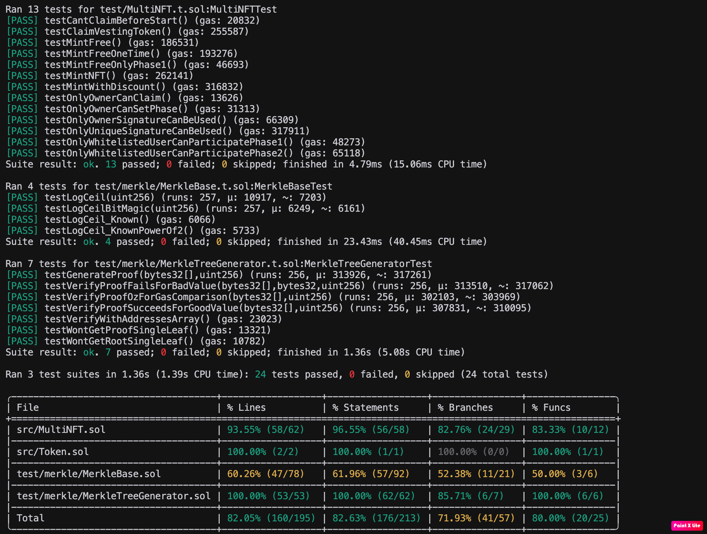

# <h1 align="center"> Multi-Utility NFT Contract </h1>

## Overview
The MultiNFT contract is a versatile ERC721-based NFT contract that supports phased minting, discounted minting with signatures, and vesting functionality. It is designed to handle three distinct minting phases:

**Phase 1**: Whitelisted users can mint NFTs for free using Merkle proofs.

**Phase 2**: Selected users can mint NFTs at a discounted price using Merkle proofs and signatures.

**Phase 3**: Open minting for everyone at the full price.

Additionally, the contract includes a vesting mechanism that locks minting fees in a linear vesting schedule, allowing the contract owner to claim vested tokens over time.

## Usage

**Phased Minting**:

- Phase 1: Free minting for whitelisted users (verified via Merkle proofs).
- Phase 2: Discounted minting for selected users (verified via Merkle proofs and signatures).
- Phase 3: Open minting for everyone at the full price.

**Vesting Mechanism**:
- Minting fees are locked in a linear vesting schedule for one year.
- Only the contract owner can claim vested tokens.

**Security**:
- Uses OpenZeppelin's ReentrancyGuard to prevent reentrancy attacks.
- Ensures signatures are not reused.
- Validates Merkle proofs to prevent unauthorized minting.

**Flexibility**:
- The contract owner can update the minting phase and transfer ownership.

## Usage
- Set the Minting Phase:
```bash
nft.setPhase(MultiNFT.Phase.Phase1);
```
- Mint an NFT in Phase 1:
```bash
nft.mintFree(proof);
```
- Mint an NFT in Phase 2:
```bash
nft.mintWithDiscount(proof, signature);
```
- Mint an NFT in Phase 3:
```bash
nft.mintNFT();
```
- Claim Vested Tokens:
```bash
nft.claimVestedTokens();
```

## Testing
The contract includes a comprehensive test suite written in Foundry. To run the tests:
```bash
forge test
```

**Test Coverage**

- Phased Minting:
    - Valid and invalid Merkle proofs.
    - Valid and invalid signatures.
- Vesting Functionality:
    - Linear vesting schedule.
    - Token withdrawal by the owner.
- Edge Cases:
    - Reentrancy attacks.
    - Invalid phases.




## Security

The contract uses OpenZeppelin's **ReentrancyGuard** to prevent reentrancy attacks. Additionally, it ensures:
- Signatures cannot be reused.
- Merkle proofs are validated to prevent unauthorized minting.
- Only the owner can claim vested tokens.
